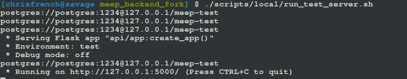
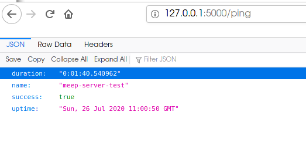

# Meep Backend 2.0

See the old [`README.md`](./README.old.md) for information about how to install and setup this repo using Docker, and for Windows/Linux.

For the time being, the following instructions are for how to set up the Meep Backend end _locally_ with the Meep frontend on Linux/macOS.

## Requirements

- PostgreSQL 9+
- PostgreSQL extension PostGIS
- Python 3.7+ ([`requirements.txt`](./api/src/requirements.txt))

## Install

### Install `pipenv`

- Install `pipenv` if you don't have it already.

#### Linux

```sh
pip install pipenv
```

#### macOS with Homebrew

```sh
brew install pipenv
```

### Git clone the repo

```sh
git clone https://github.com/codeforkansascity/meep-backend.git
```

And the `cd` to `./meep-backend`.

### Install Python dependencies

```sh
pipenv install
```

### Make sure PostgreSQL/PostGIS is setup

The test database has been switched from sqlite3 to PostgreSQL with the PostGIS extension. See [https://postgis.net/install/](https://postgis.net/install/) for how to set up the db for either Linux or macOS. If you aren't familiar with PostgreSQL, it is recommended you use 

> Note: To access the db using SQLAlchemy, you may have to change your database authentication with the `pd_hba.conf` file. How this should happen depends on your OS, but in general see [https://www.postgresql.org/docs/9.6/auth-pg-hba-conf.html](https://www.postgresql.org/docs/9.6/auth-pg-hba-conf.html).

> Note: Remember to start the PostgreSQL server if you haven't set it up to start at boot.

#### Steps

- When you install PostgreSQL, make sure to install the PostGIS extension
- Create a password for the user `postgres`, e.g. `1234`
- Create a new database called `meep-test`

The default config file is `api/instance/env.test.cfg`:

```python
PG_USER = 'postgres'
PG_PASS = '1234'
PG_HOSTNAME = '127.0.0.1'
PG_DBNAME = 'meep-test'

TESTING = True
SQLALCHEMY_TRACK_MODIFICATIONS = True
DEBUG = True
```

### Run the test script

For the moment, only a test environment is setup to integrate with the meep frontend.

The script is `scripts/local/run_test_server.sh` and it contains the following

```sh
#!/bin/sh
source $(pipenv --venv)/bin/activate
export APP_SETTINGS=env.test.cfg
export FLASK_APP="api/app:create_app()"
export FLASK_ENV=test
python api/db_operations.py reset test
flask run
```

If first activates the `pipenv` environment, uses `api/instance/env.test.cfg` as the Flask configuration file, resets the PostgreSQL/PostGIS database using `python api/db_operations.py reset test` (if you want to run this manually, do `pipenv api/db_operations.py reset test`). Finally, it starts the backend API as a Flask app.

#### Make sure the test script is executable

```sh
chmod +x scripts/local/run_test_server.sh
```

#### Run the server

```sh
./scripts/local/run_test_server.sh
```

#### Run Test Server with Randomized Data

You can also run the server with randomly generated data. To do this ensure the development packages are also installed:

```sh
pipenv install --dev
```

Export the Google Maps API key to your shell environment. This is the same key used in the frontend, ask a maintainer if you do not have it.

```sh
export GOOGLE_API_KEY='<key>'
```

Then run the test server with the `rand` argument and how many projects you want to generate. If you do not provide a number, it will generate the default of 5 projects.

```sh
./scripts/local/run_test_server.sh rand <number>
```

Generating projects can take several minutes. If you wish to re-use the last set of projects instead of waiting to regenerate more, you can run the script with the `last` argument:

```sh
./scripts/local/run_test_server.sh last
```

### Test the server

If everything went correctly, in the terminal you should see:



and if you open your browser to `127.0.0.1:5000/ping` you should see


